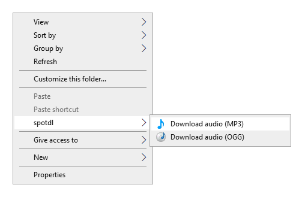

# SpotDL Windows Explorer Integration

Download Spotify songs/playlists/albums and more (even an artist's full archive of albums and songs) right in the Windows Explorer!

Huge credit to [Wolfgang](https://github.com/notthebee)



### Supported formats:
* MP3, OGG

### How to use it
1. [Download the ZIP archive of this repository](https://github.com/Hesbadami/spotdl-explorer/archive/refs/heads/main.zip)
2. Unpack the archive
3. Double-click on the spotdl.reg file and confirm adding the keys to the registry
4. Copy the spotify link, go to the folder where you want to download it
5. Right click on the empty space and choose your option
6. Voilà!

This script requires **[spotify-downloader](https://github.com/spotDL/spotify-downloader)** and **ffmpeg**.

**To install spotdl and ffmpeg:**

Open a PowerShell as Administrator and run:
```
Set-ExecutionPolicy Bypass -Scope Process
Set-ExecutionPolicy Bypass -Scope Process -Force; [System.Net.ServicePointManager]::SecurityProtocol = [System.Net.ServicePointManager]::SecurityProtocol -bor 3072; iex ((New-Object System.Net.WebClient).DownloadString('https://chocolatey.org/install.ps1'))
choco install ffmpeg python
pip install --upgrade spotipy ytmusicapi pytube spotdl --force
```

### Uninstalling spotdl-explorer
To uninstall the script, Double-click on the uninstall.reg file and confirm the changes.
